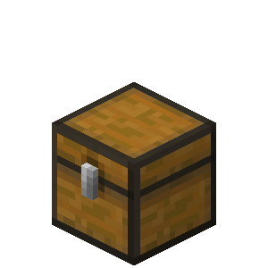

<h1>InventoryManager</img>&nbsp;</h1>
<br />

A PocketMine-MP plugin to easily save inventories in a database.

# Usage

* Download this plugin
* You can put it on your server or put the api in the src of your plugin
* To use it you'll have to import `DatabaseManager` object and the `InventoryManager` object.

## Be careful !
If you have put the api in your folder, you need to run these lines of code in the onEnable function of your main file
```php
    $db = DatabaseManager::getInstance();
       
    if(!$db->isEnabled()){
        $db->init();
    }
```

## Basic Usage
### Import the classes
You'll need to import these classes in order to easily use it within our code.
```php
<?php
use Nathan45\Inventories\DatabaseManager;
use Nathan45\Inventories\InventoryManager;
```
### Access to managers
DO NOT use `new` ! <br/>
YOU MUST USE `getInstance()` function as shown below.
```php
$db = DatabaseManager::getInstance();
$api = InventoryManager::getInstance();
```

### Functions
There are 7 main functions which are all in the InventoryManager class <br/>
* __getAllData()__ > it returns an array with all existing player inventories, it follows this pattern: `$array[$player][$id] = [item1, item2, etc]. `
* __setAllData(array $inventories)__ > It replaces all existing player inventories by the given array.
* __getInventoriesFor(Player|string $player)__ > This function returns all inventories of the given player in the order.
* __getInventoryFor(Player|string $player, string|int $inventoryId)__ > This function returns the player's inventory corresponding to the given id.
* __setInventoriesFor(Player|string $player, array $inventories)__ > This function sets all ths inventories of the given player in the order.
* __setInventoryFor(Player|string $player, string|int $id, array $inventories)__ > This function sets the player's inventory corresponding to the given id.
* __updateDataFor(string $player)__ > This function stores the player's inventories in the database.

##Here is a basic example with an event
```php
public function onUseItem(PlayerItemUseEvent $event): void{

        $api = InventoryManager::getInstance();
        $player = $event->getPlayer();

        switch ($event->getItem()->getId()){
            case ItemIds::GOLD_INGOT:
                $api->setInventoryFor($player, "gold_inventory", $player->getInventory()->getContents()); // You can also put an int as id.
                break;

            case ItemIds::GOLD_BLOCK:
                $player->getInventory()->setContents($api->getInventoryFor($player, "gold_inventory"));
                break;
        }
    }
```
